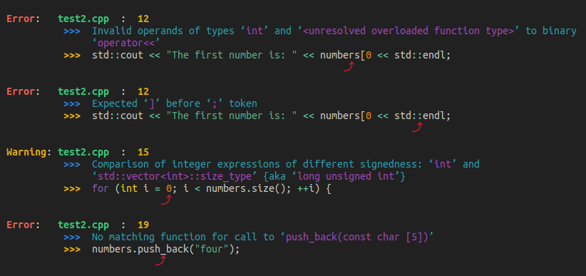

# GCC error message formatter

Produces easy-to-read GCC error and warning messages<br>




## Overview

- Uses GCC's `-fdiagnostics-format=json` flag
- Works with Make et al. as long as the only `[{` JSON object `}]` in the output is GCC's


## Run demonstration

```
$ bash setup.sh
$ python format_gcc_output.py
```

## To do

- Add "childen" error messages

```
{
    "kind": "error",
    "column-origin": 1,
    "children": [
        {
            "kind": "note",
            "locations": [
                {
                    "caret": {
                        "byte-column": 18,
                        "display-column": 18,
                        "line": 8,
                        "file": "test1.c",
                        "column": 18
                    }
                }
            ],
            "message": "each undeclared identifier is reported only once for each function it appears in"
        }
    ],
    "locations": [
        {
            "caret": {
                "byte-column": 18,
                "display-column": 18,
                "line": 8,
                "file": "test1.c",
                "column": 18
            }
        }
    ],
    "message": "\u2018f\u2019 undeclared (first use in this function)"
}
```
