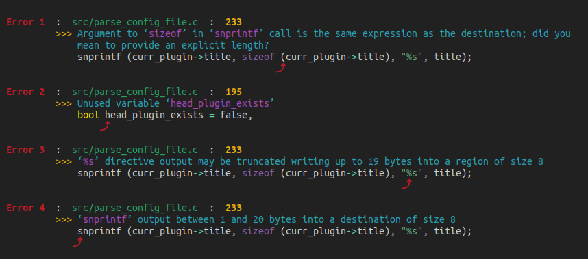

# GCC error message parser

Produces easy-to-read GCC error messages<br>




## Overview

- Uses GCC's `-fdiagnostics-format=json` flag
- Works with Make et al. as long as the only `[{` JSON object `}]` in the output is GCC's


## Run demonstration

```
$ bash setup.sh
$ python format_gcc_output.py
```

