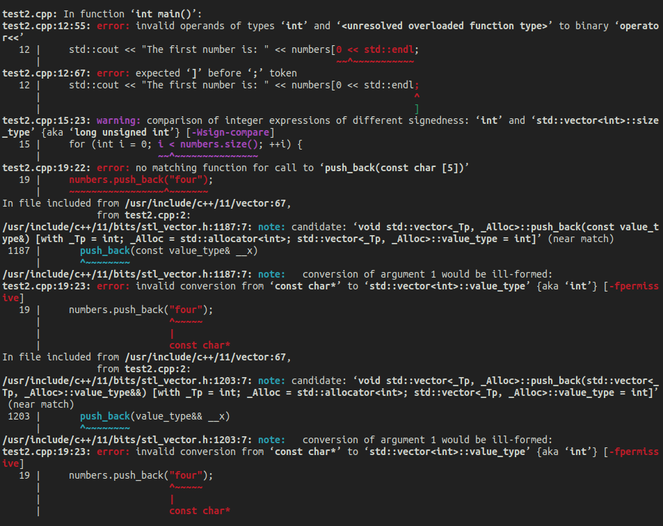

# GCC error formatting

Minimalist, easy-to-read GCC error messages<br>

Go from:<br>


To:<br>


## Overview

- Uses the `-fdiagnostics-format=json` flag
- Works with Make et al. as long as the only `[{` JSON objects `}]` in the output are GCC's


## Usage

```python
from format_gcc_output import format_gcc_output

command = ['g++', '-Wall', '-Wextra', '-fdiagnostics-format=json', 'test2.cpp']

format_gcc_output (command)
```


## Color configuration

Personalize the colors at the top of `format_gcc_output.py` with the values in `colors.py`.<br>


## Development

### Run tests
```bash
$ ./run_tests
```


### Get unformatted errors
```bash
$ ./get_unformatted_errors
```

### To do
- Add an option to list all child "note" error messages as well
